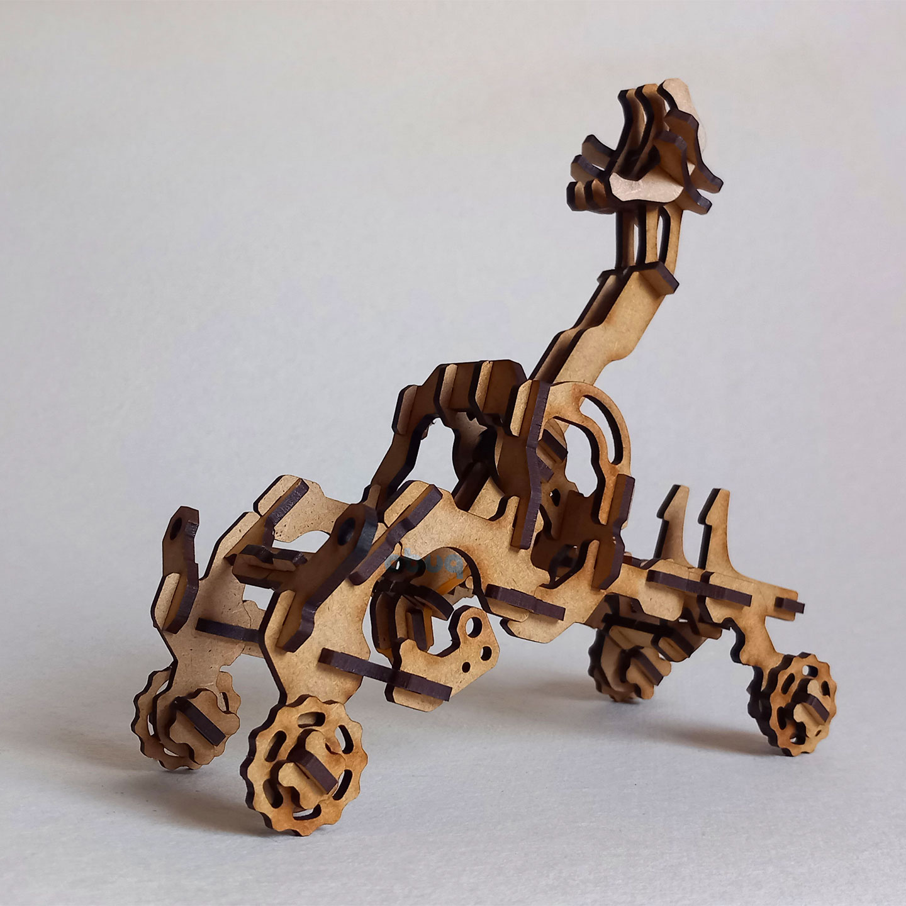

# Axis Catapult #2



More information and additional images:  
https://obuqdesign.wordpress.com/2025/06/15/axiscatapult-2/

<br>

## Details

| Property | Value |
|---|---|
| Type | Tridimensional model (64 pieces) |
| Designed for | 3mm mdf or plywood |
| Dimensions | Height: 170mm; Length: 175mm; Width: 100mm |
| Design file format | DXF R14 |
| Units | mm |
| Frame | 130x220mm (x2) – ReadyToCut Layout |
| Scalable | Yes |

<br>
<hr>
<br>

<div align="center">
  If you like this design and would like to support my work:
  <br><br>
  https://buymeacoffee.com/obuq
</div>

<br>
<hr>
<br>

<div align="center">

#### Thank you to all the patrons that supported me when this design was initially posted on Patreon

<br>

Roman Kupalov  
patreon person  
Wouter Simons  
Todd  
Rudenz Schulz  
Darkly Labs  
Aaron J Radke  
Renzo Ciarma  
Ray

</div>
```
